# 小龙虾 OpenClaw Win安装教程 
- openclaw地址:https://github.com/openclaw/openclaw
- 安装文档:https://docs.openclaw.ai/start/getting-started

## 1. 安装OpenClaw
- 前置安装:Node.js 
- Windows的PowerShell执行: iwr -useb https://openclaw.ai/install.ps1 | iex
- Linux、Mac执行: curl -fsSL https://openclaw.ai/install.sh | bash
- 后面的向导操作键：上下左右键移动选项。空格键是选中。回车键确认。

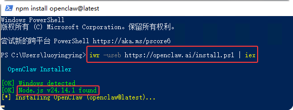

- 安装完成后第一个提示，是否继续。选继续

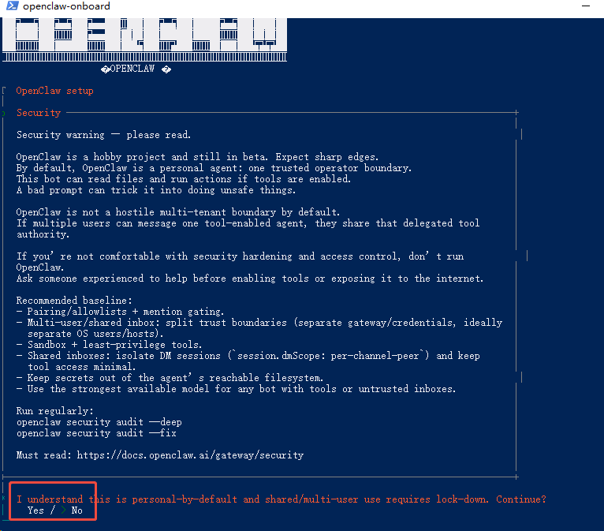

- 向导的第二个步骤，配置模型。直接选Skip for now

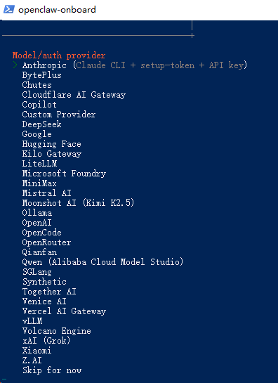

- 第三步，设置默认模型。选Keep Current

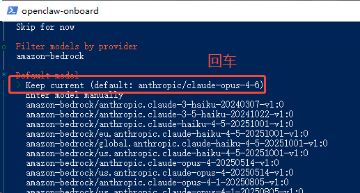

- 第四步，添加Channel。选Skip for now

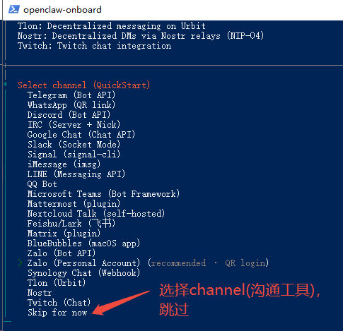

- 第五步，添加搜索接口。选Skip for now

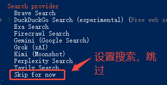

- 第六步，配置Skill，选择Yes
- 第七步，选择Skill。这里选了:1password、clawhub、github、xurl。然后回车
- 第八步，选择node manager。这里选npm
- 第九步，GOOGLE_PLACES_API_KEY选NO
- 第十步，NOTION_API_KEY选NO
- 第十一步，OPENAI_API_KEY选NO
- 第十二步，ELEVENLABS_API_KEY选NO
- 第十三步，Enable hooks选Skip for now

- 如果提示Gateway  services missing.用openclaw gateway install安装。可能是node版本的问题。可以让AI执行

## 2. 接入企业微信
### 2.1. 安装企业微信插件
- openclaw plugins install @wecom/wecom-openclaw-plugin
### 2.2. 准备企业微信Bot ID
- 工作台选智能机器人->创建机器人->手动创建->设置信息->API创建->使用长连接->复制BotID和Secret

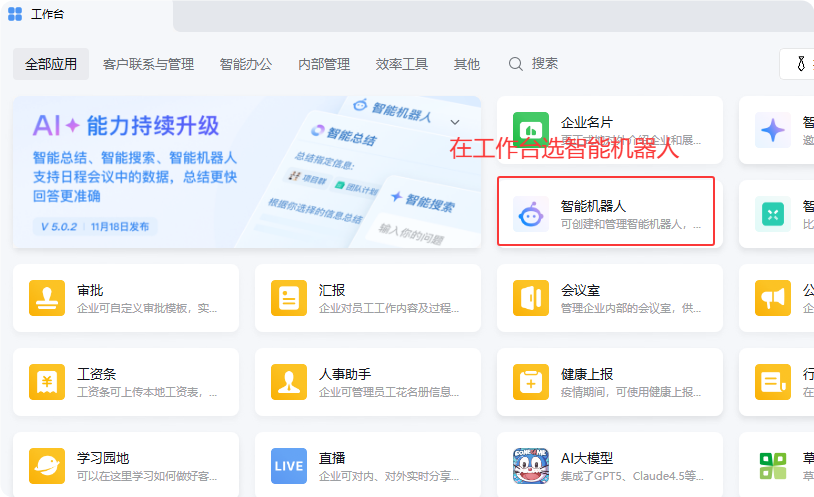

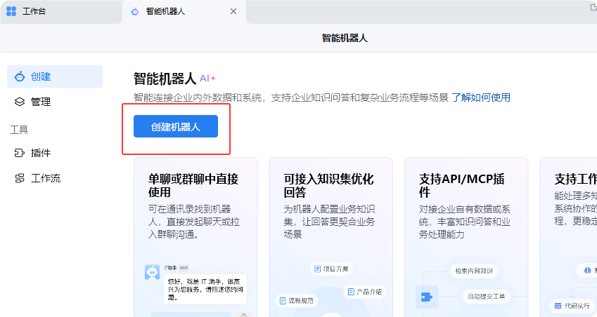

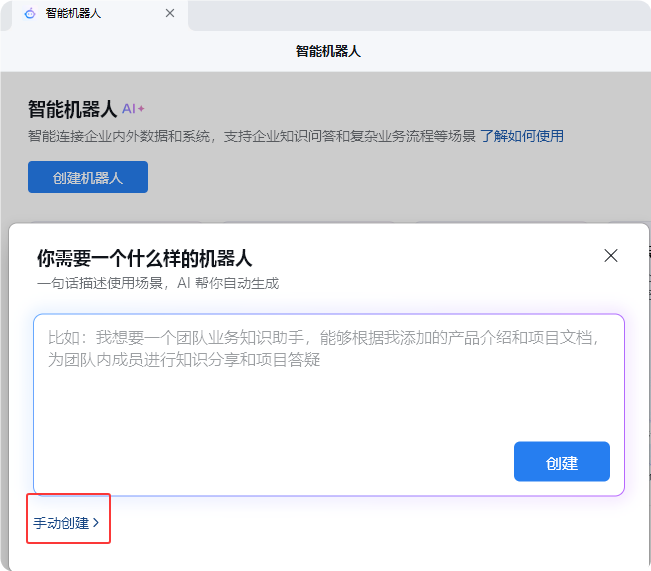

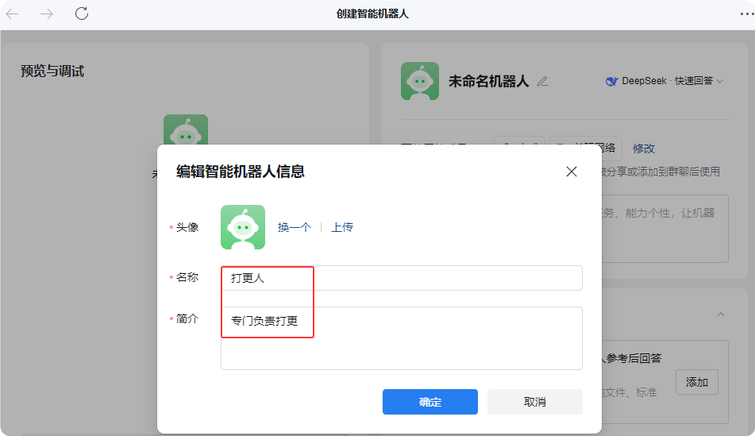

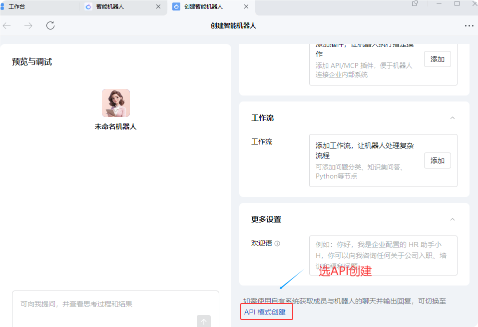

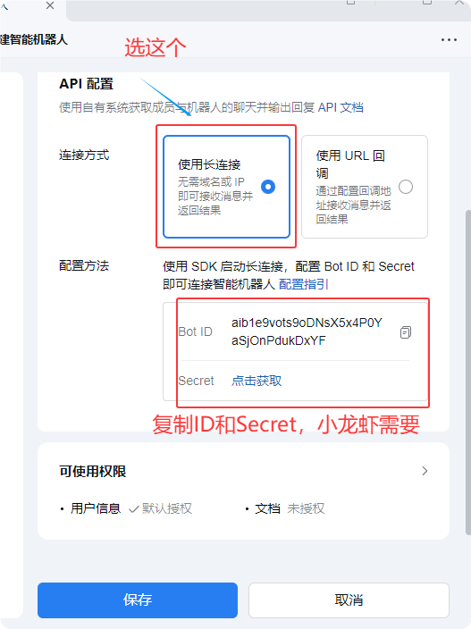

### 2.3. 配置企业微信聊天
- 执行openclaw configure
- 选择Local
- 选择channel，现在可以看到企业微信了

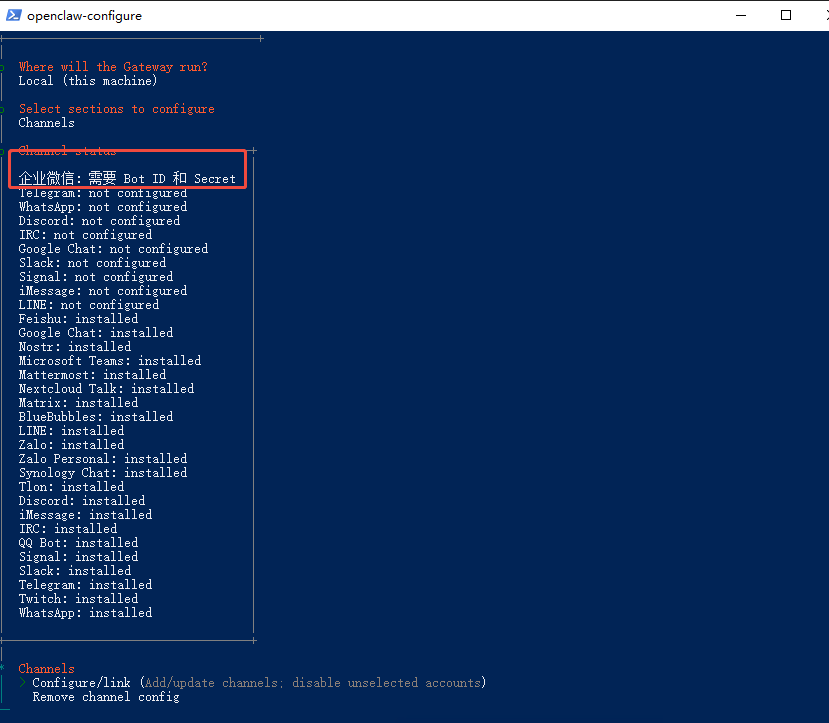
- 选择Configure/link
- 选择企业微信。提示需要企业微信的Bot ID和Secret
- Enter Bot ID。粘贴前面企业微信机器人得到的值
- Enter Secret。粘贴前面企业微信机器人得到的值
- 选择Finished
- 问你：Configure DM access policies now? (default:pairing).输入Yes
- 选择配对
- 退出

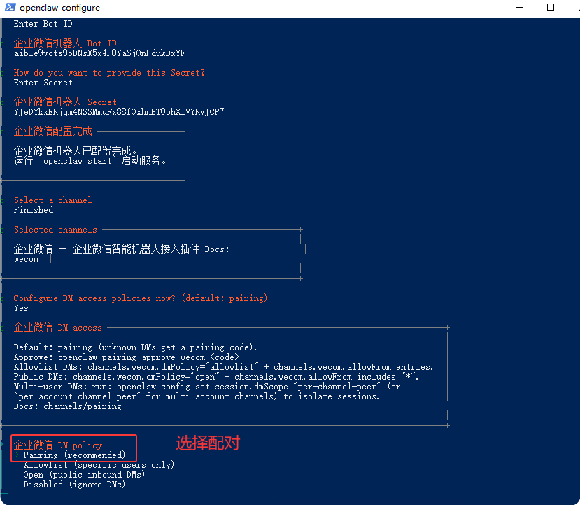

### 2.4. 等待机器人配对。 接下来先配置模型

## 3. 配置模型
- 将提供的openclaw.json文件覆盖到用户目录
- C:\Users\xxx\\.openclaw
- 修改：你的API-Key(sk-开头)为自己的API-KEY
- 修改配置文件中的"你的用户名"为自己的电脑用户名
- 修改"你的BotID"为自己机器人的Bot ID
- 修改"你的Secret"为自己机器人的Secret

## 4. 测试
- 在PowerShell中输入openclaw gateway restart。重启网关，成功后如下图

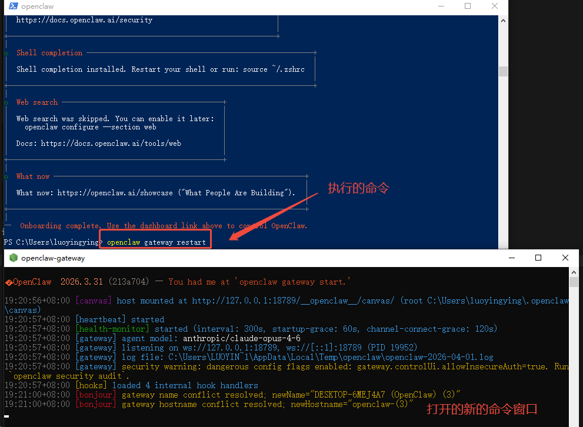
- 打开网页聊天：openclaw dashboard
- 可以进行对话

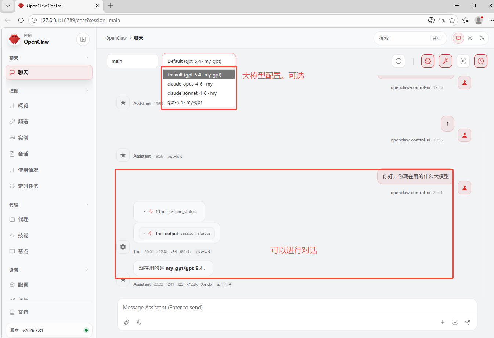

## 5. 配对机器人
- 在企业微信与机器人对话。会得到一个命令。去小龙虾电脑上的PowerShell执行
- 完成配对

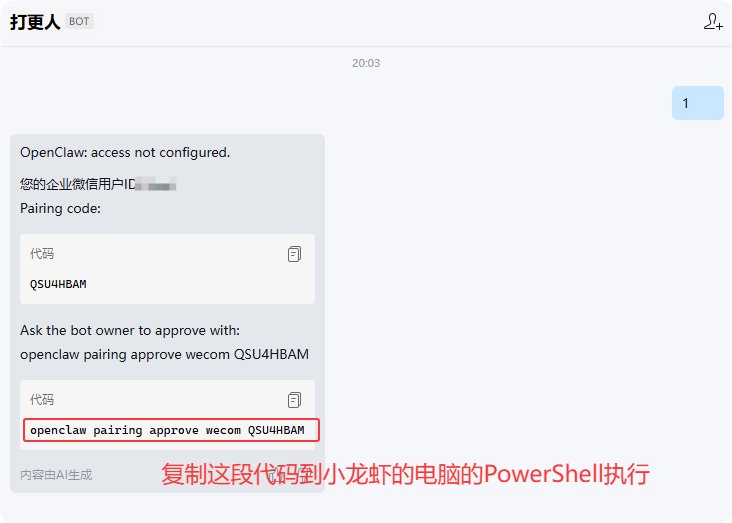

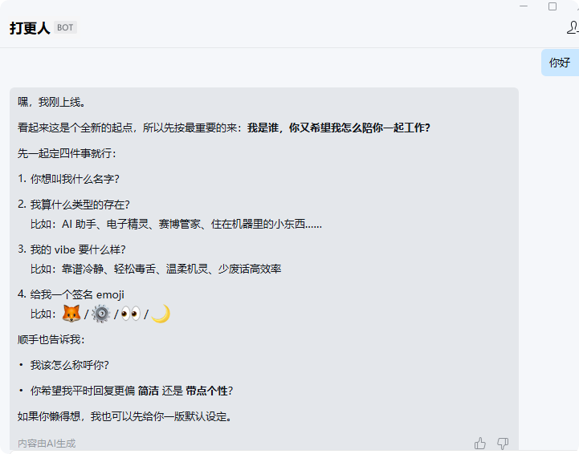

## 常用命令
- 重启网关：openclaw gateway restart
- 打开tui：openclaw tui
- 打开网页：openclaw dashboard
- 升级：openclaw update
- 配置向导：openclaw configure

# 同一台电脑配置第二只龙虾
## 1. 配置
- 使用命令：openclaw --profile code configure开始第二只的配置
- 选择Local(this machine)
- 选择workspace。修改为C:\Users\Administrator\.openclaw-code\workspace
- 选择Gateway
- 输入端口号(没占用的)，默认第一只是18789，这里可以写18790
- Gateway bind mode:选择Loopback
- Gateway auth:选择Token
- Tailscale exposure:选择Off
- Gateway token source:选择Generate/store plaintext token
- 下一步显示token，直接回车
- 完成

## 2. 重新配置模型、插件
- 需要按第一只的步骤重新配置大模型
- 安装企业微信插件
- 配对企业微信

## 3. 所有命令都得加上--profile dgr3
- openclaw --profile dgr3 gateway restart
- openclaw --profile dgr3 dashboard
- openclaw --profile dgr3 gateway install
